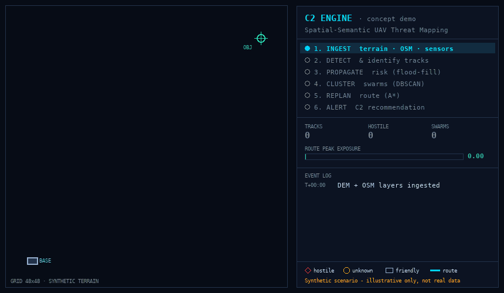

# İHA Tehdit Haritası ve Karar Destek Sistemi

### UAV/C-UAS Threat Mapping & C2 Engine — Real Data Sources


<p align="center">
  
  <br>
  <sub><i>Concept illustration of the C2 engine (detect → propagate risk → replan route). Synthetic scenario — not real data.<br>Sistemin çalışma mantığını gösteren temsili animasyon: dron tespit edilir, tehlikeli bölge belirlenir, rota güvenli yöne çevrilir. Gerçek veri değildir.</i></sub>
</p>

> A curated, evidence-based catalog of **real, citable, and — wherever possible — openly accessible** datasets and literature underpinning a NATO/C4ISR-themed senior capstone project: a **Spatial-Semantic UAV/Drone Threat Mapping & C2 Engine** for tactical field operations.

This repository exists because a good architecture is not enough — a defensible engineering project needs **evidence it can stand on**. Every entry below is a real, external, independently verifiable source: a dataset, a government report, a peer-reviewed measurement, or a standards library. Nothing here is fabricated, assumed, or synthetically generated without grounding.

> 🇹🇷 **Proje hakkında:** Bu proje, sahada İHA/dron tehditlerini harita üzerinde gösteren ve operatöre ne yapması gerektiği konusunda öneri sunan bir **karar destek sistemi**dir. Bu repo ise sistemin dayandığı **gerçek ve doğrulanabilir veri kaynaklarını** bir araya getirir: harita verileri, dron tespit veri setleri, askeri doktrin belgeleri ve bilimsel makaleler. Buradaki hiçbir bilgi uydurma değildir; her kaynağın bağlantısı, lisansı ve erişim durumu belirtilmiştir.

---

## System Architecture → Data Mapping

| Layer | Purpose | Primary Real Data Sources |
|---|---|---|
| **1. Geospatial & Sensor Ingestion** | Terrain, road/building context, baseline air traffic, real UAV detection sensor data, real incident geolocations | Copernicus DEM, AW3D30, OpenStreetMap, OpenSky Network, DUT Anti-UAV, UAVSwarm, MMAUD, Halmstad, DroneRF, FAA Sightings, ACLED |
| **2. Semantic Threat Knowledge Base** | Doctrine/TTP corpus for RAG-based threat reasoning | ATP 3-01.81, DoD C-UAS Strategy, RAND, CNAS, RUSI, ISW, NATO releases |
| **3. Grid/Graph Algorithm Engine** | Risk propagation & route-planning validated against published methods | Peer-reviewed A\*/terrain-masking/threat-cost literature |
| **4. Fusion & C2 Decision Layer** | Quantitative justification for sensor fusion over radar-only detection | Measured radar cross-section (RCS) literature |
| **5. Visualization** | Standards-compliant tactical symbology | MIL-STD-2525 / STANAG APP-6 via milsymbol.js |

Full detail for each layer lives in [`/layers`](./layers).

> 🇹🇷 **Sistem 5 katmandan oluşur:**
> 1. **Harita ve sensör verileri** — arazi, yollar, hava trafiği ve dron tespit kayıtları
> 2. **Tehdit bilgi bankası** — dronlarla ilgili resmi doktrin ve analiz raporları
> 3. **Risk ve rota hesaplama** — tehlikeli bölgeleri belirleyip güvenli rota bulma
> 4. **Veri birleştirme ve karar** — farklı sensörlerden gelen bilgileri birleştirip öneri üretme
> 5. **Görselleştirme** — sonuçları standart askeri sembollerle harita üzerinde gösterme

---

## Access Status Legend

| Badge | Meaning |
|---|---|
| 🟢 **Open** | Freely downloadable, no registration |
| 🟡 **Open + Conditional** | Accessible, but carries a license condition (NC, share-alike, attribution) |
| 🔴 **Gated** | Requires registration, approval, or a signed Data Use Agreement |
| ⚫ **Unverified** | Referenced in literature but no accessible public source found — **do not use** |
| ✅ **Personally Verified** | Downloaded/accessed directly by the project team |

Full legend and notes: [`/docs/legend.md`](./docs/legend.md)

> 🇹🇷 **Renkler ne anlama geliyor?** 🟢 serbestçe indirilebilir · 🟡 erişilebilir ama lisans şartı var · 🔴 kayıt veya izin gerekir · ⚫ doğrulanamadı, kullanılmıyor · ✅ ekibimiz tarafından bizzat erişilip denendi

---

## Quick Stats

```
Total sources catalogued:     35+
Fully open (🟢):               22
Open with conditions (🟡):      8
Gated / registration (🔴):      5
Personally verified (✅):       15 (and growing)
Unverifiable / excluded (⚫):    1
```

---

## Repository Structure

```
uav-cuas-datasets/
├── README.md                                  ← you are here
├── LICENSE
├── assets/
│   └── demo-threat-map.gif
├── layers/
│   ├── 01-geospatial-sensor-data.md
│   ├── 02-semantic-threat-knowledge-base.md
│   ├── 03-algorithm-validation-literature.md
│   ├── 04-radar-cross-section-justification.md
│   └── 05-visualization-standards.md
└── docs/
    ├── legend.md
    ├── verified-access-log.md
    └── excluded-sources.md
```

---

## Project Context

- **Project:** İHA Tehdit Haritası ve Karar Destek Sistemi (UAV/SIHA Field Operations — Spatial-Semantic Threat Mapping & C2 Engine)
- **Program:** Senior Capstone, Computer Engineering
- **Theme:** NATO / C4ISR-aligned defense-tech architecture
- **Team size:** 4
- **Maintained by:** Yağız Akkaya (project data lead)

---

## Contributing (Internal Team Use)

Found a new real dataset or source? Add it to the relevant file in [`/layers`](./layers) using the template at the bottom of that file, then update the Quick Stats count above.

---

## License

The **curation, structure, and commentary** in this repository are released under [CC0 1.0](./LICENSE) — free to reuse for academic purposes. Each *linked* dataset or document retains **its own original license**, as noted per entry. Always check the source's license before redistributing or using it commercially.

> 🇹🇷 Bu repodaki derleme ve açıklamalar serbestçe kullanılabilir. Bağlantı verilen veri setleri ve belgeler ise kendi lisanslarına tabidir.
